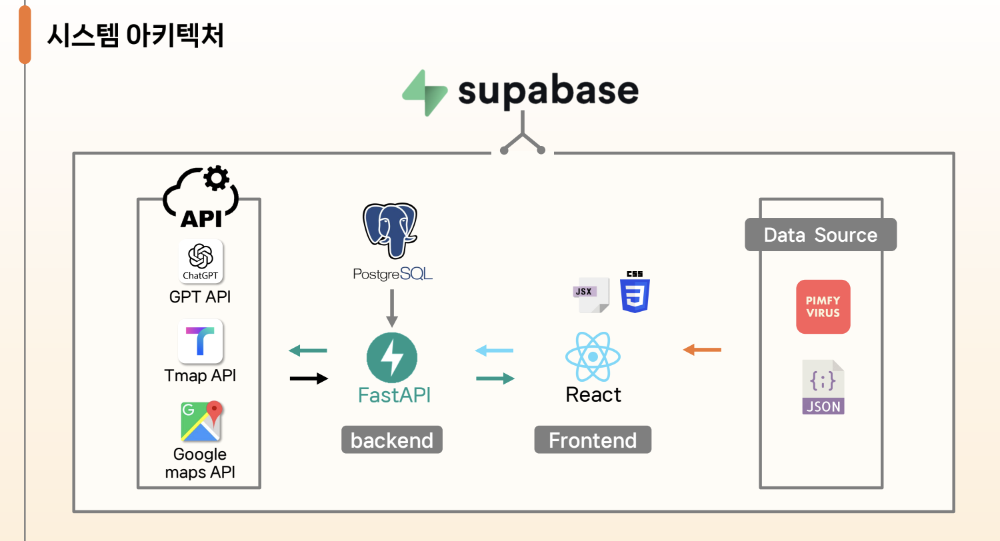

# 댕로드 프로젝트 (DangRoad)

## 1. 프로젝트 개요

### 목표 한 줄 요약
> AI 기반의 맞춤형 산책 및 임시보호 매칭 플랫폼 개발

### 해결하고자 하는 문제
- 증가하는 1-2인 가구가 반려견에게 필수적인 정기적 산책 제공이 어려운 문제
- 보호소 수용 한계로 인한 유기견 사회화 기회 부족 및 입양률 저하 문제

### 주요 기능
- 사용자 및 강아지 정보 등록 ("멍 BTI" 기반)
- 트레이너 모드 간편 전환
- GPT API를 활용한 맞춤형 산책 및 임시보호 매칭
- 실시간 GPS 위치 추적
- 사용자 리뷰의 태그별 분석 기능

## 2. 기술 스택
- **Frontend:** React, Figma
- **Backend:** FastAPI, Python
- **Database & Cloud:** Supabase, postgresql, Vercel
- **APIs:** GPT API, Tmap API, googleMaps API
- **Collaboration:** GitHub

## 3. 아키텍처


## 4. 설치 및 실행 방법

### 4.1 프로젝트 클론
```bash
git clone https://github.com/whoru000104/mainproj.git
cd mainproj
```

### 4.2 Python 백엔드 환경 설정

가상환경 생성:
```bash
python -m venv venv
```

Windows 환경 활성화:
```bash
venv\Scripts\activate
```

Mac/Linux 환경 활성화:
```bash
source venv/bin/activate
```

### 4.3 의존성 설치
```bash
pip install -r requirements.txt
```

### 4.4 서버 실행

FastAPI 서버 실행:
```bash
uvicorn backend.main:app --reload
```

React 서버 실행:
```bash
npm install
npm run dev
npm start
```

### 4.5 환경 변수 설정
프로젝트 루트 폴더에 `.env` 파일을 생성하고 필요한 환경 변수 값을 입력해주세요.

## 5. 개발 문서
- **API 명세서:** [API.md 참고](API.md)
- **와이어프레임:** [Figma 링크 바로가기](https://www.figma.com/design/8EgcgdRGRPWIuWE3sqMH09/main?node-id=0-1&t=1gARL7UlgJ9HgkVq-1)

## 6. 팀원 소개
- 강희지 (팀장): AI / Backend
- 지은혜: Backend
- 권승빈: Backend
- 송종욱: DB
- 박성빈: Frontend
- 신효진: Frontend / Design

## 7. 프로젝트 데모 영상
<<<<<<< HEAD

- 회원가입

- 멍bti 테스트

- 산책매칭

- 산책시작

- 후기

- 임시보호
=======


>>>>>>> 0b19b52839530e48ec4966da49113a1cd0d28160
